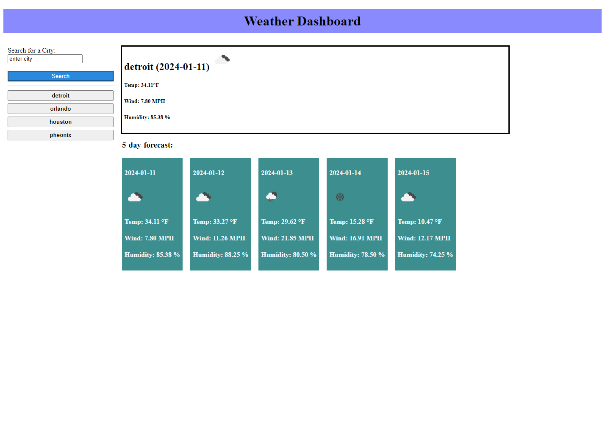

# Weather Dashboard
This is a repo to host a Weather Dashboard.

The weather dashboard interfaces with [OpenWeather API](https://openweathermap.org/) to display a five day forecast for any chosen city.

Dashboard will display the average temperature, wind speed, and humidity for each day in a given city.

The app will remember the users search history so previously requested cities are quicker to view.

[https://lukegarnsey.github.io/weather-dashboard/](https://lukegarnsey.github.io/weather-dashboard/)

